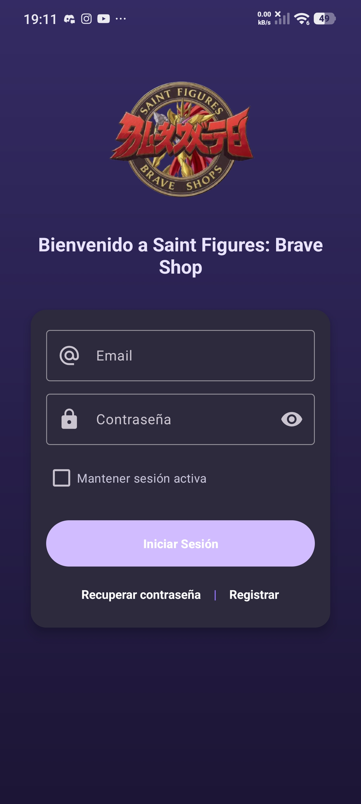
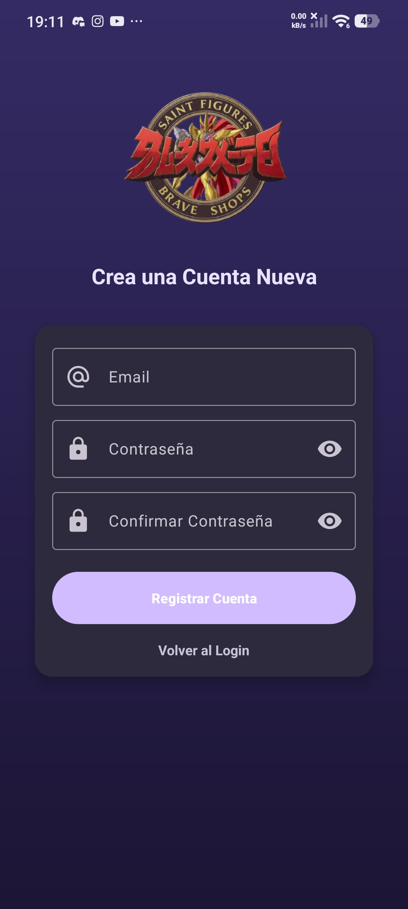
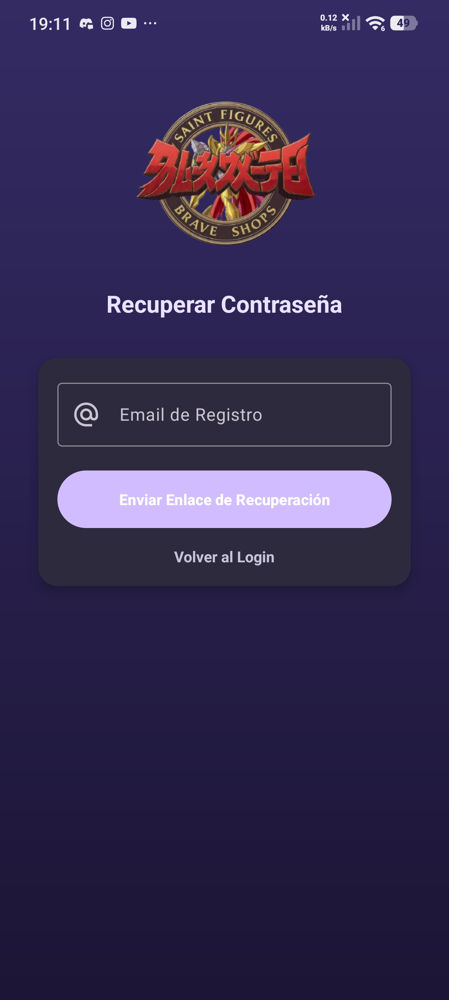

# SFBS-Mobile
El prototipo del inicio de sesión de la página web que cree anteriormente, le faltaría conectarlo a una base de datos para que esté completa

# 📱 Proyecto: Saint Figures: Brave Shop (Evaluación II - Aplicaciones Móviles para IoT)

## Descripción General
Aplicación móvil desarrollada en Android Studio (Kotlin) para simular la interfaz de login, registro y recuperación de clave de un sistema de gestión de dispositivos IoT/E-commerce. El objetivo principal es demostrar la correcta implementación de:
* Patrones de diseño de aplicaciones Android.
* Navegación fluida y segura entre Activities.
* Implementación de elementos visuales (Splash Screen, Ícono de Launcher).
* Uso de elementos interactivos (AlertDialogs).

---

## 🎯 Criterios de Evaluación Cumplidos

La aplicación cumple con los siguientes Aprendizajes Esperados (AE) y Criterios de Evaluación:

### 2.1.1 Identificación y Estándar de Diseño
* Uso de **Android Studio** y **Kotlin** para el desarrollo.
* Implementación de tema oscuro coherente y **Material Design**.
* Inclusión de **Splash Screen** con temporizador (2s) y logo personalizado.
* Ícono de Launcher (App Icon) personalizado.

### 2.1.2 Producción de Aplicación Android
* Creación de **tres Activities funcionales** (Login, Registrar Cuenta y Recuperar Clave) con diseños coherentes.
* Uso de **AlertDialogs** para simular las acciones (Login exitoso, Registro exitoso, Solicitud de clave enviada).

### 2.1.3 Seguridad en Aplicaciones IoT (ISO 27400)
* **Buenas Prácticas de Seguridad:** El código **no almacena credenciales** sensibles (usuarios o contraseñas) de forma fija o *hardcoded*. La funcionalidad de login es simulada mediante la lógica de la Interfaz de Usuario.
* Uso de `android:inputType="textPassword"` y `app:endIconMode="password_toggle"` para garantizar que las contraseñas se muestren ocultas en la interfaz, una práctica estándar de seguridad UI.

### 2.1.4 Interconexión entre Activities
* Implementación del **flujo de navegación (Intent)** que permite al usuario moverse fluidamente desde la pantalla de Login hacia Registrar Cuenta y Recuperar Clave, y viceversa.

---

## 🛠️ Tecnologías Utilizadas
* **Lenguaje:** Kotlin
* **IDE:** Android Studio
* **Diseño:** Material Components, ConstraintLayout

## 📸 Galería
| Login | Registro | Recuperar Clave |
|:---:|:---:|:---:|
|  |  |  |
